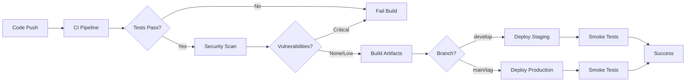

# CI/CD Pipeline Documentation

## Overview

The Password Manager project uses GitHub Actions for continuous integration and continuous deployment. The pipeline ensures code quality, security, and automated deployments to staging and production environments.

## Pipeline Architecture



## Workflows

### 1. CI Pipeline (`ci.yml`)

**Triggers:**
- Push to `main` or `develop` branches
- Pull requests to `main` or `develop` branches

**Jobs:**

#### detect-changes
- Detects which parts of the monorepo changed
- Outputs: `backend`, `frontend` flags
- Uses path filtering to optimize CI runs

#### backend-ci
- **Services:** PostgreSQL 16, Redis 7
- **Steps:**
  1. Checkout code
  2. Set up JDK 17
  3. Run Checkstyle (code style validation)
  4. Run OWASP Dependency Check (security vulnerabilities)
  5. Run tests with JaCoCo coverage
  6. Build application
  7. Generate coverage badge
  8. Upload coverage to Codecov

**Quality Gates:**
- Checkstyle must pass (no style violations)
- Tests must pass (100% success rate)
- Code coverage minimum: 70% line coverage
- OWASP: No critical/high vulnerabilities (CVSS >= 7)

#### frontend-ci
- **Steps:**
  1. Checkout code
  2. Set up Node.js 20
  3. Install dependencies
  4. Run ESLint (linting)
  5. Run Prettier check (formatting)
  6. Run tests with coverage
  7. Check bundle size
  8. Build application
  9. Upload coverage to Codecov
  10. Comment PR with coverage report

**Quality Gates:**
- ESLint must pass (no errors)
- Prettier formatting must be correct
- Tests must pass
- Bundle size within budget
- Code coverage tracked

#### security-scan
- **Tools:**
  - Trivy: Filesystem vulnerability scanner
  - npm audit: Frontend dependency vulnerabilities
  - Snyk: Advanced security scanning
  - OWASP Dependency Check: Backend vulnerabilities

- **Outputs:**
  - SARIF files uploaded to GitHub Security
  - Audit reports as artifacts
  - Security alerts in GitHub Security tab

### 2. Code Quality Pipeline (`code-quality.yml`)

**Triggers:**
- Push to `main` or `develop`
- Pull requests
- Weekly schedule (Sundays at 2 AM UTC)

**Jobs:**

#### sonarcloud
- Static code analysis with SonarCloud
- Analyzes both backend (Java) and frontend (TypeScript/React)
- Tracks code smells, bugs, vulnerabilities, and technical debt

#### codeql
- GitHub's semantic code analysis
- Runs security and quality queries
- Matrix strategy for Java and JavaScript
- Uploads results to GitHub Security

#### dependency-review
- Reviews dependency changes in PRs
- Fails on moderate+ severity vulnerabilities
- Blocks GPL-2.0 and GPL-3.0 licenses

#### license-check
- Validates all dependency licenses
- Allowed licenses: MIT, Apache-2.0, BSD-2/3-Clause, ISC, 0BSD
- Generates license reports

#### code-metrics
- Analyzes code complexity
- Generates complexity reports
- Tracks cyclomatic complexity

#### docker-security
- Scans Docker images with Trivy
- Runs Dockle security linter
- Validates Dockerfile best practices

### 3. Pull Request Checks (`pr-checks.yml`)

**Triggers:**
- Pull request opened, synchronized, or reopened

**Jobs:**

#### pr-title-check
- Validates PR title follows conventional commits
- Allowed types: feat, fix, docs, style, refactor, perf, test, chore
- Optional scopes: crypto, auth, vault, sync, security, ui, api, db, ci

#### code-review
- Checks for large files (>5MB)
- Scans for secrets with TruffleHog
- Prevents accidental commits of sensitive data

#### size-label
- Automatically labels PRs by size
- Labels: size/xs, size/s, size/m, size/l, size/xl
- Helps reviewers estimate review time

#### comment-preview
- Comments on PR with preview deployment info
- Provides checklist for PR author
- Links to preview environments

### 4. Staging Deployment (`deploy-staging.yml`)

**Triggers:**
- Push to `develop` branch
- Manual workflow dispatch

**Environment:** staging
**URL:** https://staging.your-domain.com

**Jobs:**

#### build-and-push
- Builds Docker images for backend and frontend
- Pushes to GitHub Container Registry (ghcr.io)
- Tags: `develop`, `staging`, `<branch>-<sha>`
- Uses Docker layer caching for speed

#### deploy-staging
- Deploys to staging server via SSH
- Pulls latest images
- Restarts containers with docker-compose
- Runs smoke tests
- Alternative: Kubernetes deployment (commented)

**Smoke Tests:**
- Health check: `/api/v1/health`
- Frontend check: `/`
- 30-second warm-up period

### 5. Production Deployment (`deploy-production.yml`)

**Triggers:**
- Push tags matching `v*.*.*` (e.g., v1.0.0)
- Manual workflow dispatch with version input

**Environment:** production
**URL:** https://your-domain.com

**Jobs:**

#### build-and-push
- Builds production Docker images
- Tags: `<version>`, `<major>.<minor>`, `latest`, `production`
- Semantic versioning support

#### deploy-production
- **Strategy:** Blue-Green Deployment
- Deploys new version alongside old
- Runs health checks
- Switches traffic to new version
- Removes old containers
- **Rollback:** Automatic on failure

**Smoke Tests:**
- Health check: `/api/v1/health`
- Frontend check: `/`
- 30-second warm-up period

#### create-release
- Creates GitHub Release
- Auto-generates release notes
- Attaches artifacts

### 6. Dependency Updates (`dependency-updates.yml`)

**Triggers:**
- Weekly schedule (Mondays at 9 AM UTC)
- Manual workflow dispatch

**Jobs:**

#### update-frontend-dependencies
- Runs `npm update`
- Applies `npm audit fix`
- Runs tests
- Creates PR with changes

#### update-backend-dependencies
- Updates Maven dependencies
- Uses `versions:use-latest-releases`
- Runs tests
- Creates PR with changes

#### dependabot-auto-merge
- Auto-merges patch and minor updates
- Requires tests to pass
- Only for Dependabot PRs

### 7. E2E Tests (`e2e-tests.yml`)

**Triggers:**
- Push to `main` or `develop`
- Pull requests
- Manual workflow dispatch

**Jobs:**
- Runs Cypress E2E tests
- Tests critical user journeys
- Generates test reports and videos
- Uploads artifacts on failure

## Dependabot Configuration

**File:** `.github/dependabot.yml`

**Ecosystems:**
- npm (frontend)
- Maven (backend)
- GitHub Actions
- Docker

**Schedule:** Weekly on Mondays at 9 AM UTC

**Features:**
- Auto-creates PRs for dependency updates
- Ignores major version updates for stable dependencies
- Assigns reviewers and labels
- Follows conventional commit format

## Code Coverage

### Backend (JaCoCo)
- **Minimum:** 70% line coverage
- **Reports:** XML, HTML, CSV
- **Location:** `backend/target/site/jacoco/`
- **Badge:** Generated automatically

### Frontend (Jest)
- **Reports:** LCOV, HTML
- **Location:** `frontend/coverage/`
- **PR Comments:** Automatic coverage reports

### Codecov Integration
- Uploads coverage from both backend and frontend
- Tracks coverage trends
- Comments on PRs with coverage changes
- Fails CI if coverage decreases significantly

## Security Scanning

### Tools

1. **Trivy**
   - Filesystem and Docker image scanning
   - Detects OS and library vulnerabilities
   - SARIF output to GitHub Security

2. **OWASP Dependency Check**
   - Scans Maven dependencies
   - Checks against NVD database
   - Fails build on CVSS >= 7

3. **npm audit**
   - Scans npm dependencies
   - Applies automatic fixes
   - Reports moderate+ vulnerabilities

4. **Snyk**
   - Advanced vulnerability detection
   - License compliance
   - Fix recommendations

5. **CodeQL**
   - Semantic code analysis
   - Security and quality queries
   - Supports Java and JavaScript

6. **TruffleHog**
   - Scans for secrets in code
   - Prevents credential leaks
   - Runs on every PR

### Suppression Files

**Backend:** `backend/owasp-suppressions.xml`
- Suppress false positives
- Document accepted risks
- Include expiration dates

## Deployment Strategies

### Staging
- **Strategy:** Rolling update
- **Rollback:** Manual
- **Downtime:** None (zero-downtime deployment)

### Production
- **Strategy:** Blue-Green
- **Rollback:** Automatic on failure
- **Downtime:** None
- **Health Checks:** Required before traffic switch

## Environment Variables

### Required Secrets

**GitHub Secrets:**
```
GITHUB_TOKEN              # Auto-provided by GitHub
CODECOV_TOKEN            # Codecov upload token
SONAR_TOKEN              # SonarCloud authentication
SNYK_TOKEN               # Snyk authentication
STAGING_HOST             # Staging server hostname
STAGING_USER             # Staging SSH user
STAGING_SSH_KEY          # Staging SSH private key
PROD_HOST                # Production server hostname
PROD_USER                # Production SSH user
PROD_SSH_KEY             # Production SSH private key
```

### Environment-Specific Variables

**Staging:**
```
DATABASE_URL
REDIS_URL
JWT_SECRET
API_URL
```

**Production:**
```
DATABASE_URL
REDIS_URL
JWT_SECRET
API_URL
SENTRY_DSN               # Error tracking
```

## Monitoring and Alerts

### Build Notifications
- GitHub Checks API
- PR comments
- Commit status checks

### Deployment Notifications
- Success/failure messages
- Can integrate with Slack/Discord
- Email notifications via GitHub

### Security Alerts
- GitHub Security tab
- Dependabot alerts
- CodeQL alerts
- Trivy findings

## Best Practices

### Commits
- Follow conventional commits format
- Use semantic versioning for releases
- Sign commits with GPG (recommended)

### Pull Requests
- Keep PRs small and focused
- Ensure all checks pass
- Request reviews from team members
- Update documentation

### Deployments
- Always deploy to staging first
- Run smoke tests after deployment
- Monitor logs and metrics
- Have rollback plan ready

### Security
- Never commit secrets
- Use environment variables
- Rotate credentials regularly
- Review security alerts promptly

## Troubleshooting

### CI Failures

**Tests failing:**
1. Check test logs in GitHub Actions
2. Run tests locally: `npm test` or `mvn test`
3. Verify database/Redis connections

**Coverage below threshold:**
1. Add tests for uncovered code
2. Review JaCoCo/Jest reports
3. Update coverage thresholds if needed

**Security scan failures:**
1. Review vulnerability details
2. Update dependencies
3. Add suppressions if false positive

### Deployment Failures

**Staging deployment fails:**
1. Check SSH connection
2. Verify Docker images built
3. Review server logs
4. Check disk space and resources

**Production deployment fails:**
1. Automatic rollback triggered
2. Review deployment logs
3. Check health check endpoints
4. Verify environment variables

**Smoke tests fail:**
1. Check application logs
2. Verify database migrations
3. Test endpoints manually
4. Review recent changes

## Maintenance

### Weekly Tasks
- Review Dependabot PRs
- Check security alerts
- Monitor coverage trends
- Review failed builds

### Monthly Tasks
- Update CI/CD workflows
- Review and update suppressions
- Audit access and secrets
- Performance optimization

### Quarterly Tasks
- Major dependency updates
- Security audit
- Disaster recovery test
- Documentation updates

## Resources

- [GitHub Actions Documentation](https://docs.github.com/en/actions)
- [Codecov Documentation](https://docs.codecov.com/)
- [SonarCloud Documentation](https://docs.sonarcloud.io/)
- [OWASP Dependency Check](https://owasp.org/www-project-dependency-check/)
- [Trivy Documentation](https://aquasecurity.github.io/trivy/)

## Support

For CI/CD issues:
1. Check workflow logs in GitHub Actions
2. Review this documentation
3. Contact DevOps team
4. Create issue in repository
