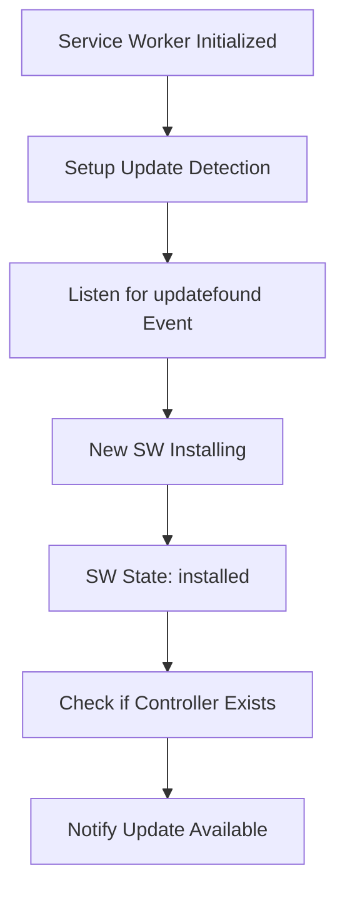
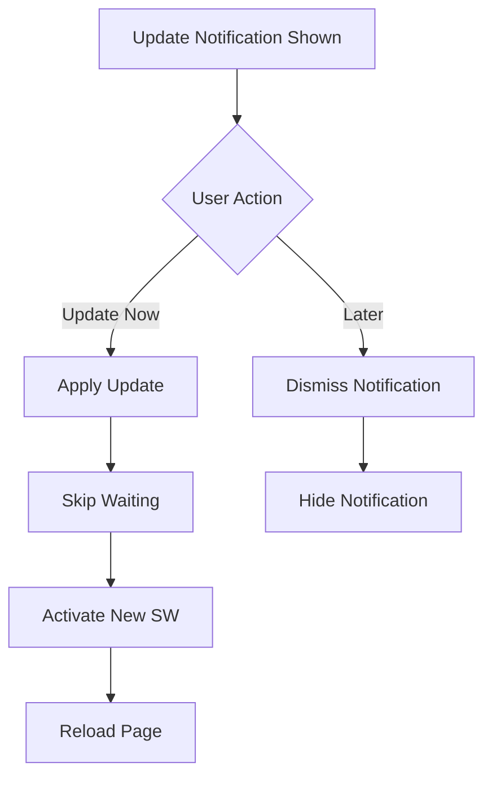

# PWA Update Mechanism

This document describes the implementation of the PWA update mechanism for the Password Manager application.

## Overview

The PWA update mechanism provides automatic detection of service worker updates and presents users with a smooth update experience. It includes:

- **Automatic Update Detection**: Detects when new service worker versions are available
- **User-Friendly Notifications**: Shows update prompts with clear actions
- **Skip Waiting Logic**: Allows immediate activation of new service workers
- **Periodic Update Checks**: Automatically checks for updates at regular intervals
- **Visibility-Based Checks**: Checks for updates when the app becomes visible
- **Error Handling**: Gracefully handles update failures

## Components

### 1. ServiceWorkerManager (`src/lib/serviceWorker.ts`)

The core service worker management class that handles:

- Service worker registration and lifecycle
- Update detection and notification
- Skip waiting and activation logic
- Periodic update checks
- Cache management

**Key Methods:**
- `initialize()`: Sets up service worker and update detection
- `checkForUpdates()`: Manually checks for service worker updates
- `updateServiceWorker()`: Applies pending updates
- `getUpdateStatus()`: Returns current update status
- `skipWaitingAndActivate()`: Immediately activates waiting service worker

### 2. useServiceWorkerUpdate Hook (`src/hooks/useServiceWorker.ts`)

React hook that provides update state and actions:

```typescript
const {
  isUpdateAvailable,
  isUpdating,
  updateStatus,
  applyUpdate,
  dismissUpdate,
  checkForUpdates,
} = useServiceWorkerUpdate();
```

**Features:**
- Tracks update availability and progress
- Provides update actions
- Handles update events
- Manages update state

### 3. PWAUpdatePrompt Component (`src/components/ui/PWAUpdatePrompt.tsx`)

User interface component that displays update notifications:

**Features:**
- Shows update available notification
- Displays update progress during installation
- Provides "Update Now" and "Later" actions
- Shows detailed update information
- Handles update errors gracefully
- Auto-checks for updates periodically

## Update Flow

### 1. Detection Phase



### 2. User Interaction Phase



### 3. Background Checks

The system performs automatic update checks:

- **Periodic Checks**: Every 30 minutes
- **Visibility Checks**: When page becomes visible
- **Manual Checks**: Via user action or API call

## Service Worker Integration

### Skip Waiting Logic

The service worker handles skip waiting messages:

```javascript
self.addEventListener('message', event => {
  if (event.data && event.data.type === 'SKIP_WAITING') {
    console.log('Skipping waiting and taking control');
    self.skipWaiting();
  }
});
```

### Activation Handling

```javascript
self.addEventListener('activate', event => {
  event.waitUntil(
    Promise.all([
      // Clean up old caches
      cleanupOldCaches(),
      // Take control of all clients
      self.clients.claim()
    ]).then(() => {
      // Notify clients of activation
      return notifyClientsOfActivation();
    })
  );
});
```

## Configuration

### Next.js PWA Configuration

```typescript
// next.config.ts
export default withPWA({
  dest: "public",
  disable: process.env.NODE_ENV === "development",
  register: true,
  workboxOptions: {
    skipWaiting: true,
    clientsClaim: true,
    // ... other options
  }
})(nextConfig);
```

### Update Check Intervals

- **Periodic Check**: 30 minutes (configurable)
- **Visibility Check**: On page focus
- **Manual Check**: User-triggered

## Error Handling

The system handles various error scenarios:

1. **Update Check Failures**: Logged and ignored
2. **Update Application Failures**: Shown to user with retry option
3. **Network Failures**: Graceful degradation
4. **Service Worker Errors**: Fallback to manual refresh

## Testing

### Unit Tests

- Component rendering and interactions
- Hook state management
- Service worker manager methods
- Error handling scenarios

### Integration Tests

- Full update flow testing
- Event handling verification
- Periodic check functionality
- User interaction flows

### Manual Testing Scenarios

1. **Update Available**: Simulate new service worker
2. **Update Installation**: Test skip waiting logic
3. **Update Errors**: Test error handling
4. **Periodic Checks**: Verify automatic checking
5. **Visibility Changes**: Test focus-based checks

## Browser Support

The PWA update mechanism supports:

- **Chrome/Edge**: Full support
- **Firefox**: Full support
- **Safari**: Limited support (no background sync)
- **Mobile Browsers**: Full support on supported platforms

## Performance Considerations

- **Minimal Bundle Impact**: Lazy loading of update components
- **Efficient Checking**: Debounced update checks
- **Cache Management**: Automatic cleanup of old caches
- **Memory Usage**: Proper event listener cleanup

## Security Considerations

- **HTTPS Required**: Service workers only work over HTTPS
- **Same-Origin Policy**: Updates must come from same origin
- **Content Security Policy**: Proper CSP headers required
- **Update Verification**: Integrity checks on service worker files

## Troubleshooting

### Common Issues

1. **Updates Not Detected**
   - Check service worker registration
   - Verify HTTPS connection
   - Check browser developer tools

2. **Update Fails to Apply**
   - Check console for errors
   - Verify service worker file accessibility
   - Try manual page refresh

3. **Notification Not Showing**
   - Check notification permissions
   - Verify event listeners are attached
   - Check component mounting

### Debug Tools

- Browser DevTools > Application > Service Workers
- Console logging in service worker and main thread
- Network tab for service worker file requests
- PWA audit tools

## Future Enhancements

Potential improvements to the update mechanism:

1. **Update Scheduling**: Allow users to schedule updates
2. **Rollback Support**: Ability to rollback to previous version
3. **Update Channels**: Support for beta/stable channels
4. **Bandwidth Awareness**: Respect user's data preferences
5. **Update Analytics**: Track update success rates
6. **Progressive Updates**: Partial updates for large applications

## API Reference

### ServiceWorkerManager

```typescript
class ServiceWorkerManager {
  // Initialization
  initialize(): Promise<void>
  
  // Update Management
  checkForUpdates(): Promise<boolean>
  updateServiceWorker(): Promise<void>
  skipWaitingAndActivate(): Promise<void>
  getUpdateStatus(): UpdateStatus
  
  // Utility Methods
  isServiceWorkerSupported(): boolean
  getCacheUsage(): Promise<CacheUsage | null>
  clearCaches(): Promise<void>
}
```

### useServiceWorkerUpdate Hook

```typescript
interface UseServiceWorkerUpdateReturn {
  isUpdateAvailable: boolean;
  isUpdating: boolean;
  updateStatus: UpdateStatus;
  applyUpdate: () => Promise<void>;
  dismissUpdate: () => void;
  checkForUpdates: () => Promise<boolean>;
}
```

### PWAUpdatePrompt Component

```typescript
interface PWAUpdatePromptProps {
  // No props - uses hook internally
}
```

## Conclusion

The PWA update mechanism provides a robust, user-friendly way to keep the Password Manager application up-to-date. It balances automatic updates with user control, ensuring a smooth experience while maintaining security and performance.